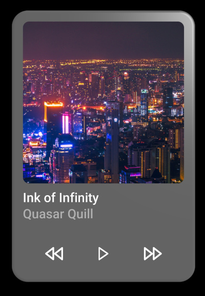

# :beginner: Getting started using the Coconut-XR Ecosystem

In this getting started tutorial, we build a simple, immersive, draggable music player.


_If you encounter problems during this tutorial, please visit our [Discord](https://discord.com/invite/NCYM8ujndE) for help._

This Tutorial Goes over the basics for the individual libraries of the Coconut-XR Ecosystem. If you are interested in one library specifically, please check out the documentations for the respective libraries:

- User Interface Library - [Koestlich](https://coconut-xr.github.io/koestlich/)
- WebXR Interaction Library - [Natuerlich](https://coconut-xr.github.io/natuerlich/)
- Pre-designed Component Library - [Apfel Krumel](https://github.com/coconut-xr/apfel-kruemel).

## Development Setup

For the basic development setup, please fork and clone this repository and use `npm install` to install all dependencies. Alternatively, follow along using this [CodeSandbox](https://codesandbox.io/s/natuerlich-getting-started-setup-frzncg?file=/src/app.tsx).

<details>
  <summary>Learn more about the dependencies we use.</summary>

We leverage a set of libraries that simplify building our application. In particular, we use `@coconut-xr/koestlich` for building the user interface, `@coconut-xr/apfel-kruemel` for a set of pre-designed components, such as lists, `@coconut-xr/lucide-koestlich` for icons, `@coconut-xr/natuerlich` for interactivity, and `@react-three/fiber` and `three` for handling the rendering. This template uses `vite` to build the application.

</details>

Using the command `npm run dev`, we can start the development server and access the page in the browser to see the application containing an empty canvas for now.

The following code shows the current setup inside the `app.tsx` file. The file currently contains the `XRCanvas` imported from `@coconut-xr/natuerlich/defaults`. The canvas is configured to fill the whole screen and unwanted interactions are disabled using the `cssStyle`.

```tsx
import { XRCanvas } from "@coconut-xr/natuerlich/defaults";

const cssStyle = {
  touchAction: "none",
  overscrollBehavior: "none",
  userSelect: "none",
  position: "absolute",
  inset: 0,
} as const;

export default function Index() {
  return <XRCanvas style={cssStyle}></XRCanvas>;
}
```

*The final code for this tutorial can be found in `app-final.tsx`.*

## Adding a glass panel

Now that we are familiar with the basic setup, we add a glass panel to the scene. We make the glass panel grabbable from any device (mouse, touch, VR, AR, and others). First, we use `<color/>` to set the background color to `"black"`. Then, we add a directional light to the scene, pointing from the coordinates `1, 1, 2` to the origin. Next, we add a camera for non-immersive sessions, positioning it 1.5 meters above the ground at coordinates `0, 1.5, -0.1`. After that, we add a `RootContainer` from `@coconut-xr/koestlich`, which is required to create a user interface. Inside the root container, we add a glass element with rounded corners using the `borderRadius` property. Finally, we wrap the `RootContainer` in a `Grabbable` component, positioning it at `0, 1.5, -0.5`, making the user interface grabbable.


```tsx
import { Grabbable, XRCanvas } from "@coconut-xr/natuerlich/defaults";
import { RootContainer } from "@coconut-xr/koestlich";
import { Suspense } from "react";
import { NonImmersiveCamera } from "@coconut-xr/natuerlich/react";
import { Glass } from "@coconut-xr/apfel-kruemel";

const cssStyle = {
  ...
} as const;

export default function Index() {
  return <XRCanvas style={cssStyle}>
    <color args={["black"]} attach="background" />
    <directionalLight position={[1, 1, 2]} />
    <NonImmersiveCamera position={[0, 1.5, -0.1]} />
    <Grabbable position={[0, 1.5, -0.5]}>
      <RootContainer
        flexDirection="column"
        padding={8}
        borderRadius={8}
        pixelSize={0.001}
      >
        <Glass padding={100} borderRadius={20}>
        </Glass>
      </RootContainer>
    </Grabbable>
  </XRCanvas>
}
```

## Adding the AR & VR buttons

Next, we enable entering the application from an AR and VR device.
Therefore, we create `enterAR` and `enterVR` functions to enter a VR or AR session from the `AR` and `VR` buttons. For creating these functions, we need to define the `sessionOptions`. In this case, we'll set `"local-floor"` and `"hand-tracking"` as required features. With the `sessionOptions`, we can now use the `useEnterXR` hook to create the enter functions for AR and VR. We will then use these functions in the onClick handler of two buttons that will be appended to the end of the interface. We'll position these buttons absolutely in the top-left corner of the screen. After that, we'll add an `ImmersiveSessionOrigin`, allowing us to place the origin of the player in the 3D scene; by default, it is set at coordinates `0,0,0`. Inside this origin, we'll add the default `Hands` and `Controllers`, allowing the user to rotate, resize, and reposition the glass panel in both VR and AR. This integration ensures a seamless and interactive user experience across different virtual environments.


```tsx
...
import { NonImmersiveCamera, ImmersiveSessionOrigin, useEnterXR } from "@coconut-xr/natuerlich/react";

const cssStyle = {
  ...
} as const;

const sessionOptions: XRSessionInit = {
  requiredFeatures: ["local-floor", "hand-tracking"],
};

export default function Index() {
  const enterAR = useEnterXR("immersive-ar", sessionOptions);
  const enterVR = useEnterXR("immersive-vr", sessionOptions);

  return <>
    <XRCanvas style={cssStyle}>
      ...

      <ImmersiveSessionOrigin>
        <Hands />
        <Controllers />
      </ImmersiveSessionOrigin>

      ...
    </XRCanvas>

    <button
      style={{
        padding: "1rem",
        position: "absolute",
        top: "1rem",
        left: "1rem",
      }}
      onClick={enterAR}
    >
      AR
    </button>

    <button
      style={{
        padding: "1rem",
        position: "absolute",
        top: "5rem",
        left: "1rem",
      }}
      onClick={enterVR}
    >
      VR
    </button>
  </>
}
```

## Adding the user interface elements of the music player

Next up, we fill the glass panel with content. We begin by reducing the padding of the glass panel to `10px`. Then, we add a `DefaultStyleProvider`, setting the default color for all texts and icons inside it to `"white"`. Afterwards, we incorporate an image component wrapped in a suspense mechanism, ensuring it loads the image from `"image.jpg"` inside the `public` folder. We manually set the `index` of the image to `0`, assuring the correct order while the image is loaded asynchronously. Finally, we enrich the content with the name of the album and the artist by using the `Text` component. By carefully assembling these elements, we achieve a visually appealing and functional design for the glass panel.


```tsx
import {
  Image,
  Text,
  Container,
  DefaultStyleProvider,
} from "@coconut-xr/koestlich";
import { Suspense } from "react";
import { Glass, IconButton } from "@coconut-xr/apfel-kruemel";
import { FastForward, Play, Rewind } from "@coconut-xr/lucide-koestlich";

...

export default function Index() {
  ...
  return (
    <>
      <XRCanvas style={cssStyle}>
        ...
            <Glass padding={10} borderRadius={20}>
              <DefaultStyleProvider color="white">
                <Suspense>
                  <Image
                    url={"image.jpg"}
                    width={200}
                    borderRadius={8}
                    index={0}
                  />
                </Suspense>
                <Text index={1} marginTop={8}>Ink of Infinity</Text>
                <Text index={2} opacity={0.5}>Quasar Quill</Text>
              </DefaultStyleProvider>
            </Glass>
        ...
      </XRCanvas>
      ...
    </>
  );
}
```

In the last step, we add the rewind, play, and fast forward controls using the `IconButton` component from `@coconut-xr/apfel-kruemel` and icons from `@coconut-xr/lucide-koestlich`.



```tsx
import {
  Image,
  Text,
  Container,
  DefaultStyleProvider,
} from "@coconut-xr/koestlich";
import { Suspense } from "react";
import { Glass, IconButton } from "@coconut-xr/apfel-kruemel";
import { FastForward, Play, Rewind } from "@coconut-xr/lucide-koestlich";

...

export default function Index() {
  ...
  return (
    <>
      <XRCanvas style={cssStyle}>
        ...
            <Glass padding={10} borderRadius={20}>
              <DefaultStyleProvider color="white">
                ...

                <Container
                  index={3}
                  marginTop={16}
                  width="100%"
                  flexDirection="row"
                  justifyContent="space-evenly"
                >
                  <IconButton>
                    <Rewind height={16} width={16} />
                  </IconButton>
                  <IconButton>
                    <Play height={16} width={16} />
                  </IconButton>
                  <IconButton>
                    <FastForward height={16} width={16} />
                  </IconButton>
                </Container>
              </DefaultStyleProvider>
            </Glass>
        ...
      </XRCanvas>
      ...
    </>
  );
}
```

And that is it! If you made it this far, congratulations! If you are curious to learn more, visit our [Discord](https://discord.com/invite/NCYM8ujndE) or learn more about the libraries we just used in their respective documentations:

- User Interface Library - [Koestlich](https://coconut-xr.github.io/koestlich/)
- WebXR Interaction Library - [Natuerlich](https://coconut-xr.github.io/natuerlich/)
- Pre-designed Component Library - [Apfel Kruemel](https://github.com/coconut-xr/apfel-kruemel).
